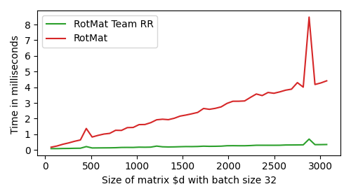

# Compare SOTA Orhogonal Matrix Forward+Backward Multiplication Algorithms with Givens-Orthogonal-Backprop

Cayley transform and fasth algorithm code is copied fromm the repository of 'What if Neural Networks had SVDs?"
https://github.com/AlexanderMath/fasth

@inproceedings{fasth,
    title={\{W}hat if {N}eural {N}etworks had {SVD}s?},
    author={Mathiasen, Alexander and Hvilsh{\o}j, Frederik and J{\o}rgensen, Jakob R{\o}dsgaard 
    and Nasery, Anshul and Mottin, Davide},
    booktitle={NeurIPS},
    year={2020}
}

